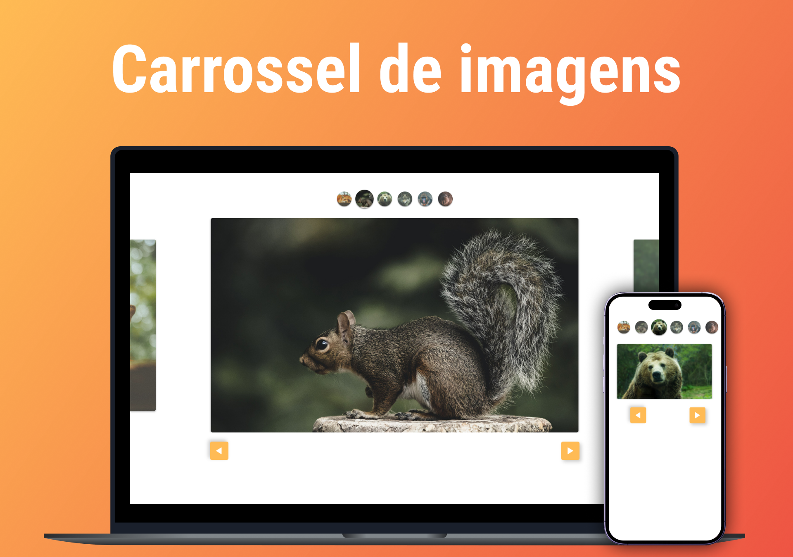

<h1 align="center"> Carrossel de Imagens </h1>

 Projeto desenvolvido durante o curso de JavaScript da plataforma Origamid. 

  <a href="#tecnologias">Tecnologias</a>&nbsp;&nbsp;&nbsp;|&nbsp;&nbsp;&nbsp;
  <a href="#projeto">Projeto</a>

  

 

  

<h2 id="tecnologias">🚀 Tecnologias</h2>

Esse projeto foi desenvolvido com as seguintes tecnologias:

- HTML
- CSS
- JavaScript

<h2 id="projeto">💻 Projeto</h2>

O Carrossel de Imagens é um projeto interativo desenvolvido durante o curso de JavaScript da Origamid, onde aprendi a criar um carrossel do zero, sem o uso de bibliotecas externas. Ele permite que o usuário navegue entre imagens utilizando botões de controle ou gestos de deslizar (swipe), proporcionando uma experiência fluida e responsiva em diferentes dispositivos. Durante o desenvolvimento, trabalhei com manipulação do DOM, controle de eventos de clique e toque, além da aplicação de transições suaves, tornando a navegação mais intuitiva e dinâmica.

👉 [Clique aqui para acessar o projeto!](https://gabriellytegon.github.io/Slide-Curso-Origamid/) 